# Boosting Contrastive Self-Supervised Learning with False Negative Cancellation

Link: [https://arxiv.org/abs/2011.11765](https://arxiv.org/abs/2011.11765)

## 0. Self-Supervised Learning

Self-supervised learning is an unsupervised learning method where the supervised learning task is created out of the unlabelled input data.

This task could be as easy as knowing the upper half of an image and predicting the lower half, or knowing the grayscale version of a colorful image and predicting the RGB channels of the same image, and so on.

### Why Self-Supervised Learning?

A lot of labelled data is usually required for supervised learning. Obtaining high-quality labelled data is costly and time-consuming, especially for more complex tasks like object detection and instance segmentation, which require more detailed annotations. Unlabeled data, on the other hand, is in plentiful supply.

The goal of self-supervised learning is to first learn useful representations of data from an unlabeled pool of data and then fine-tune the representations with a few labels for the supervised downstream task. The downstream task could be as straightforward as image classification or as complex as semantic segmentation, object detection, and so on.

Notably, most state-of-the-art methods are converging around and fueled by the central concept of contrastive learning [1,2]

### What is Contrastive Learning?

Contrastive learning aims to group similar samples closer and diverse samples far from each other. 

Suppose we have a function f(represented by any deep network Resnet50 for example), given an input x, it gives us the features f(x) as output. Contrastive Learning states that for any positive pairs x1 and x2, the respective outputs f(x1) and f(x2) should be similar to each other and for a negative input x3, f(x1) and f(x2) both should be dissimilar to f(x3).

  

## **1. Problem Definition**

The embedding space in contrastive learning is governed by two opposing forces: positive pair attraction and negative pair repellence, which are effectively actualized through contrastive loss.

Recent breakthroughs rely on the instance discrimination task, in which positive pairs are defined as different views of the same image, whereas negative pairs are formed by sampling views from different images, regardless of semantic information [1,2]

Positive pairs derived from different views of the same image are generally trustworthy because they are likely to have similar semantic content or features. **It is, however, far more difficult to create valid negative pairs**. Negative pairs are commonly defined as samples from various images, but their semantic content is ignored.

## **2. Motivation**

> Without knowledge of labels, automatically selected negative pairs could actually belong to the same semantic category and hence, creating false negatives.
> 

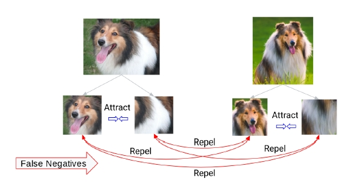

Figure 2: False Negatives in Contrastive Learning

For instance, in figure 2, the dog’s head on the left is attracted to its fur (positive pair), but repelled from similar fur of another dog's image on the right (negative pair), creating contradicting objectives.

> Considering undesirable negative pairs encourages the model to discard their common features through the embedding, which are indeed the common semantic content and slow convergence.
> 

> Therefore, the author proposes novel approaches to identify false negatives, as well as two strategies to mitigate their effect which are false negative elimination and attraction.
> 

While recent efforts focus on improving architectures [1,3] and data augmentation [1], relatively little work considers the effects of negative samples, especially that of false negatives. Most existing methods focus on mining hard negatives [4,5] (i.e., the true negatives that are close to the anchor, which is distinct from false negatives) or most recently, reweighting positive and negative terms [6] to reduce the effects of undesirable negatives. While formulated differently, their approach is similar to multi-crop [7], in that it increases the contribution of positive terms by substracting them in the denominator of the contrastive loss, whereas multi-crop does so by adding positive terms in the numerator. **However, both methods still fail to identify false negatives and lack semantic feature diversity and those are the reasons why this paper comes.**

## **3. Method**

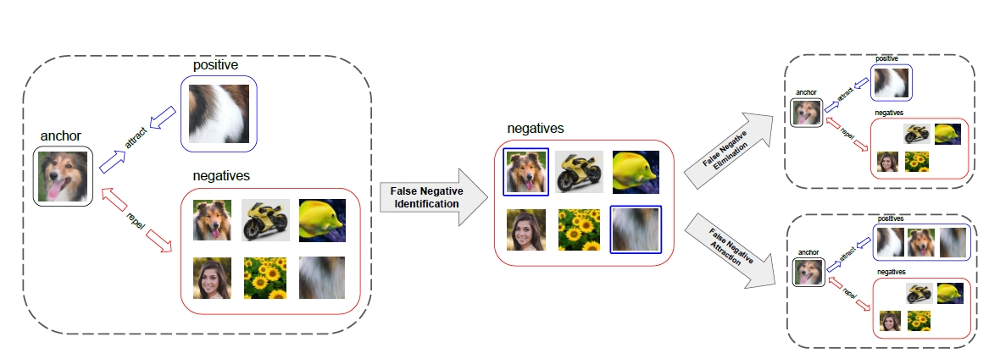

Figure 3: Overview of the Proposed Framework

**Left:** Original definition of the anchor, positive, and negative samples in contrastive learning

**Middle:** Identification of false negatives (blue)

**Right:** False negative cancellation strategies, i.e. elimination and attraction

### Contrastive Learning

For each anchor image i, measures the similarity between its embedding *zi* and that of its positive match *zj* relative to the similarity between the anchor embedding of k ∈ {1, . . . , M} negative matches:

Figure 4: Contrastive Learning Loss

**Example:**

Let's say we have two images in a batch and the augmented pairs are taken one by one

Figure 5: Augmented Images in Batch

Next, we apply the softmax function to get the probability of these two images being similar

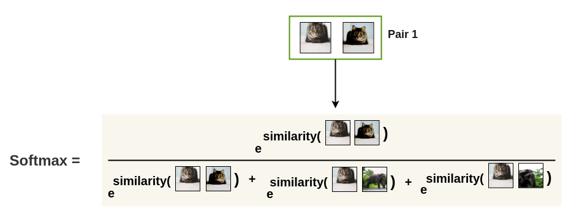

Figure 6: Calculation of Softmax

This softmax calculation is equivalent to getting the probability of the second augmented cat image being the most similar to the first cat image in the pair. Here, all remaining images in the batch are sampled as dissimilar images (negative pairs).

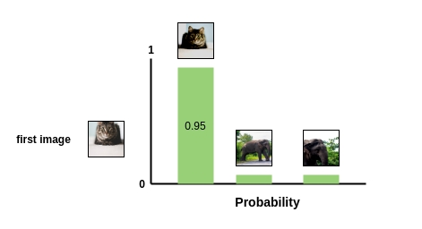

Figure 7: Softmax Visualization

Then, the loss is calculated for a pair by taking the negative of the log of the above calculation. This formulation is the Noise Contrastive Estimation(NCE) Loss.

Figure 8: Contrastive Learning Loss Visualization

where similarity formula is as shown below:

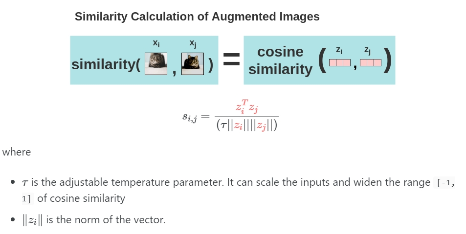

Figure 9: Cosine Similarity

Below is the visualization of pairwise cosine similarity between each augmented image in a batch

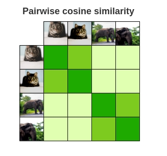

Figure 10: Pairwise Cosine Similarity Visualization

### False Negative Elimination

> The simplest strategy for mitigating the effects of false negatives is to not contrast against them.
> 

 Following is the slight modification to the contrastive learning loss formula above:

 Figure 11: False Negative Elimination Loss

The only difference here from the previous formula is they strict that **k must not be in the subset of Fi (refer to yellow highlight) →** We will discuss later on how to find false negatives

### False Negative Attraction

Minimizing the original contrastive loss (1) only seeks to attract an anchor to different views of the same image. **Including true positives drawn from different images would increase the diversity of the training data and, in turn, has the potential to improve the quality of the learned embeddings.**

> Thus, the authors propose to treat the false negatives that have been identified as true positives and attract the anchor to this set.
> 

Below is the new loss attraction:

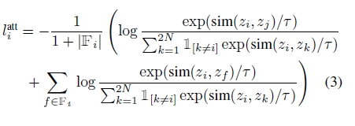

Figure 12: False negative attraction loss

### Finding False Negatives

> False negatives are samples from different images with the same semantic content, therefore they should hold certain similarity
> 

> A false negative may not be as similar to the anchor as it is to other augmentations of the same image, as each augmentation only holds a specific view of the object
> 

Pictures: A, B

Main views:  A1, A2, B1, B2

Support views: A3, A4

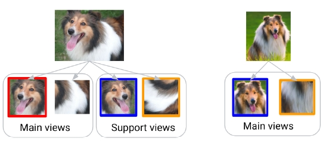

 Figure 13: Introducing Support Views

The picture of the dog’s head on the right side is not an augmented version of the anchor (main views left side). Consequently, while it is similar to the anchor image, it would thus be treated as a negative match by contemporary self-supervised methods (false negative). However, we can see that this image is more similar to the augmented view of the anchor (”support views”) than it is to the anchor with respect to the orientation of the dog’s face.

Motivated by the above observation, the authors propose a strategy for identifying candidate false negative as follows:

> **Step-by-step explanation (refer to the above dog support views figure):**
> 
1. Let’s choose the dog picture on the left side (A) as our anchor where it has two augmented versions (A1, A2) and two support views (A3, A4) as defined above.
2. Next, we define the dog’s picture on the right side (B) which has two augmented versions (B1, B2) and regarded this as our negative sample. We compute the similarity scores between two images based on the cosine similarity formula between each negative sample and each in the support set (**score**→ B1 with A3, B1 with A4, B2 with A3, B2 with A4)
3. Aggregate the computed scores for each negative sample score **(it can be max / mean aggregation)**
4. Define a set (Fi) for the negative samples that are most similar to the support set based on the aggregated scores **(can be based on top-k matches or setting the threshold)**

> **Below are the steps from the paper for reference:**
> 

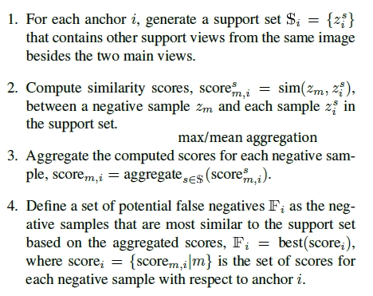

Figure 14: Steps from Paper as Reference

## **4. Experiment**

### Experiment setup

The authors tested in the same configurations as SimCLR V2 for pretraining and evaluation.

- Base encoder: ResNet-50 with a 3-layer MLP projection head
- Data augmentation: random crops, color distortion, and gaussian blur
- Number of epochs: 100
- Batch size: 4096
- Dataset: ImageNet ILSVRC-2012
- Baseline: SimCLR
- Evaluation metric: accuracy (TP + TN / TP + TN + FP+ FN)

### Results

1. **False negative cancellation consistently improves contrastive learning across crop sizes and the gap is higher for bigger crops**

Figure 15: False Negative Elimination and SimCLR across Random Crop Ratio and Threshold

> They postulate that the bigger gap for larger crop sizes is due to the increased chance of having common semantic content in big crops, which leads to a higher ratio of false negatives
> 
1. **Having a support set helps in finding false negatives regardless of the cancellation strategy, with greater benefits with the attraction strategy**

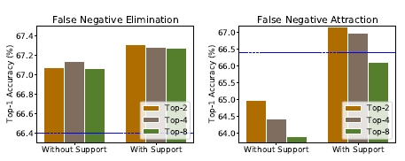

  Figure 16: False Negative Cancellation with and without Support Set

  *(the dashed line denotes the performance of SimCLR baseline)*

> This likely results from the fact that the attraction strategy is more sensitive to invalid false negatives, justifying the use of a support set to reliably find false negatives
> 
1. **Maximum aggregation significantly and consistently outperforms mean aggregation for the attraction strategy**

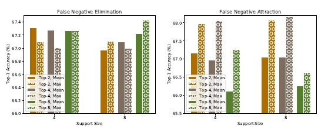

Figure 17: False Negative Cancellation(Mean and Max Aggregation) Support Size and Top-K

> This may be due to the fact that false negatives are similar to a strict subset of the support set, in which case considering all elements as in mean aggregation corrupts the similarity score
> 
1. **Filtering by top-k tends to perform better than by a threshold, while a combination of both provides the best balance**

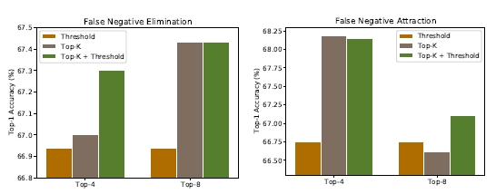

 Figure 18: Top-K and Threshold for False Negative Elimination and Attraction

1. **False negative attraction is superior to elimination when the detected false negatives are valid**
    
    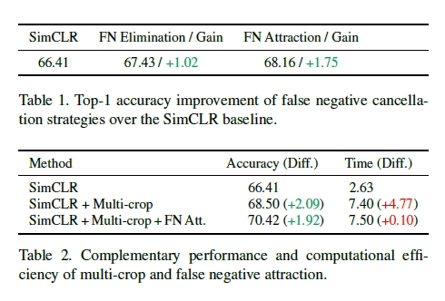
    
2. **Multicrop and momentum encoders help get higher accuracy**

Figure 19: Top-1 accuracy improvement of false negative cancellation for different baselines.

**Multicrop:** support set can also be used as additional positive views for multi-crop to double the performance

**Momentum encoders:** offers more options for finding false negatives → whether to use support set from the main encoder or the momentum encoder or whether to find negatives from samples in the current batch or all samples in memory.

### Pretraining Settings

for false negative cancellation:

- max aggregation
- top-k = 10
- threshold = 0.7 for filtering the scores
- support size = 8

**Baseline:** MoCo v1, PIRL, PCL, SimCLR v1, MoCo v2, SimCLR v2, InfoMin, BYOL, SwAV

**Number of epochs:** 1000

**Batch size:** 4096

**Dataset:** ImageNet

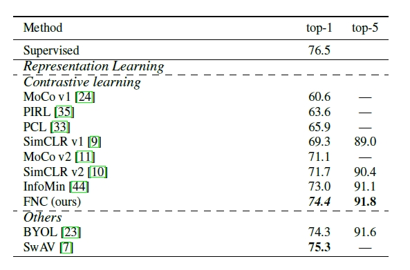

 Figure 20: ImageNet Linear Evaluation

> In terms of top-1 accuracy, FNC (proposed method) is the highest among all of the baseline models except SwAV
> 

### Transferring Features

Figure 21: Transfer Learning on Classification Task using ImageNet-pretrained ResNet Models across 12 Datasets.

> In finetuning, FNC (proposed method) outperforms both SimCLR v1 and v2 on all but one dataset, and matches that of BYOL, with each being superior on about half of the datasets
> 

## **5. Conclusion**

In this paper, the authors address a fundamental problem in contrastive self-supervised learning that has not been adequately studied, identifying false negatives, and propose strategies to utilize this ability to improve contrastive learning frameworks. As a result, their proposed method significantly boosts existing models and sets new performance standards for contrastive self-supervised learning methods.

In my opinion, the FNC (proposed method) is simple as it is the extended version of previous models, making it easy to combine with any kind of existing contrastive self-supervised learning. Likewise, it is also quite powerful in mitigating the effects of false negatives in contrastive learning and improving the state of self-supervised learning for Computer Vision.

---

## **Author Information**

- Bryan Wong
    - Master Student at Korea Advanced Institute of Science of Technology (KAIST)
    - Exploring Self-Supervised Learning, Vision Transformers, and Incremental Learning in medical domain

## **6. Reference & Additional materials**

### Website References:

- [**Github Implementation**](https://github.com/google-research/fnc)
- [**Self-supervised-learning-methods-for-computer-vision**](https://towardsdatascience.com/self-supervised-learning-methods-for-computer-vision-c25ec10a91bd)
- [**Illustrated SimCLR**](https://amitness.com/2020/03/illustrated-simclr/#:~:text=b.&text=SimCLR%20uses%20a%20contrastive%20loss,these%20two%20images%20being%20similar)

### Paper References:

[1] T.Chen, S. Kornblith, M. Norouzi, and G. Hinton. A simple framework for contrastive learning of visual representations. In Proc. *Int’l Conf. on Machine Learning* *(ICML)*, 2020.

[2] K. He, H. Fan, Y. Wu, S. Xie, and R. Girshick. Momentum contrast for unsupervised visual representation learning. In Proc. *IEEE Conf. on Computer Vision and Pattern Recognition (CVPR)*, 2019.

[3] T. Chen, S. Kornblith, K. Swersky, M. Norouzi, and G. Hinton. Big self-supervised models are strong semi-supervised learners. In Advances in Neural Information Processing Systems
(NeurIPS), 2020.

[4] J. Robinson, C.-Y. Chuang, S. Sra, and S. Jegelka. Contrastive learning with hard negative samples. arXiv preprint arXiv:2010.04592, 2020.

[5] Y. Kalantidis, M. B. Sariyildiz, N. Pion, P. Weinzaepfel, and D. Larlus. Hard negative mixing for contrastive learning. In Advances in Neural Information Processing Systems (NeurIPS), 2020.

[6] C.-Y. Chuang, J. Robinson, L. Yen-Chen, A. Torralba, and S. Jegelka. Debiased contrastive learning. In Advances in Neural Information Processing Systems (NeurIPS), 2020.

[7] M. Caron, I. Misra, J. Mairal, P. Goyal, P. Bojanowski, and A. Joulin. Unsupervised learning of visual features by contrasting cluster assignments. In Advances in Neural Information
Processing Systems (NeurIPS), 2020.